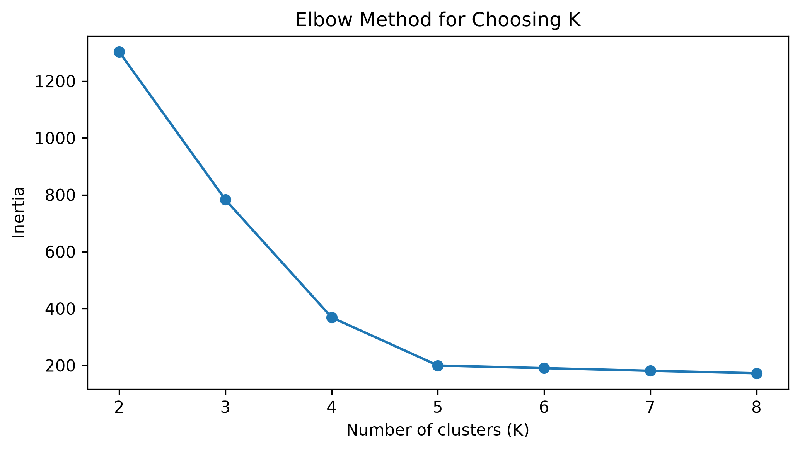
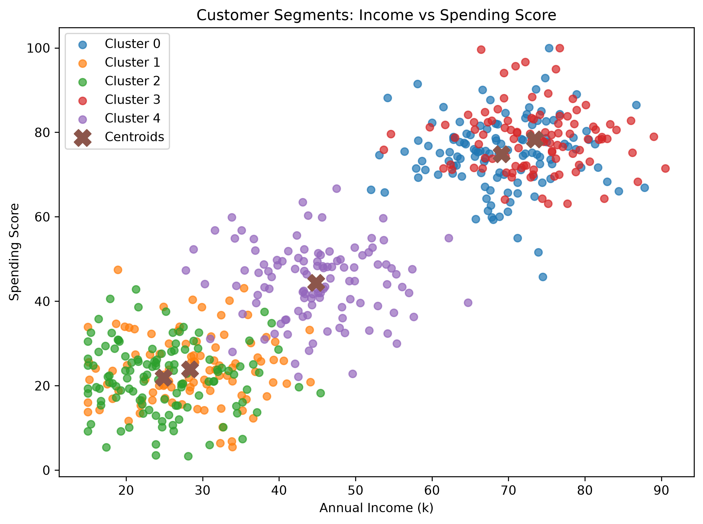

# Customer Segmentation using K-Means Clustering

## Objective
Segment mall customers based on demographic and shopping behavior using **K-Means clustering**.

## Dataset
The included `data/mall_customers.csv` contains **550 diverse customer records** with:
- Age
- Annual income
- Purchase frequency
- Spending score

The dataset is synthetic and created for this educational clustering task.

## Workflow
1. Load and inspect the data
2. Select clustering features
3. Standardize the features
4. Use the Elbow Method
5. Train K-Means with K=5
6. Evaluate using Silhouette Score
7. Visualize clusters using 2D plots
8. Summarize the clusters

## Result
- Number of clusters: **5**
- Silhouette Score: **0.624**

## Project Structure
```text
customer_segmentation_kmeans_task6/
├── customer_segmentation_kmeans.ipynb
├── README.md
├── requirements.txt
├── data/
│   └── mall_customers.csv
└── outputs/
    ├── elbow_method.png
    ├── income_vs_spending_clusters.png
    ├── age_vs_spending_clusters.png
    └── cluster_summary.csv
```

## Visuals

### Elbow Method


### Income vs Spending Score


Other graph:
`outputs/age_vs_spending_clusters.png`

The notebook contains the `plt.savefig(...)` code for every graph.

## Run
```bash
pip install -r requirements.txt
jupyter notebook customer_segmentation_kmeans.ipynb
```
