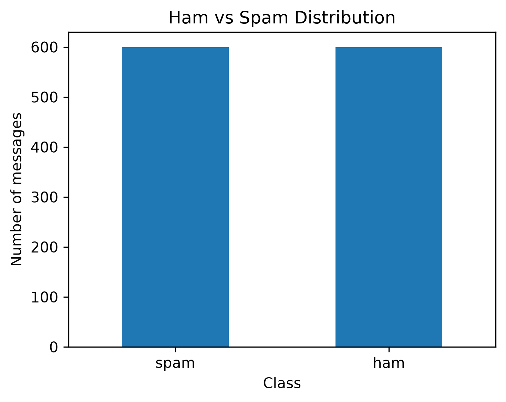
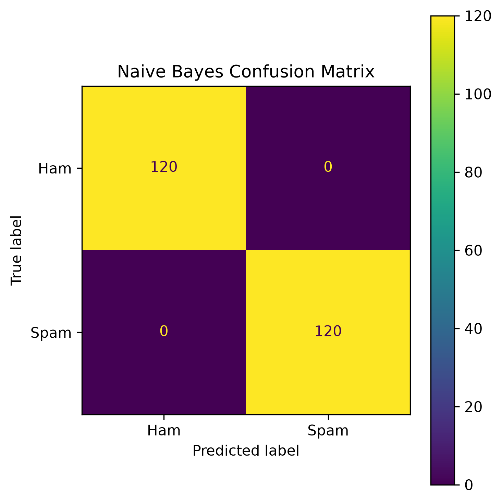

# Email Spam Detection using Naive Bayes

## Objective
Classify messages as **ham** (legitimate) or **spam** using TF-IDF and a Multinomial Naive Bayes classifier.

## Dataset
The included `data/spam_ham_dataset.csv` contains **1,200 labeled messages**:
- 600 ham
- 600 spam

The dataset is synthetic and created for this educational task.

## Workflow
1. Load labeled ham/spam messages
2. Split into training and testing sets
3. Convert text into TF-IDF features
4. Train Multinomial Naive Bayes
5. Evaluate the classifier
6. Test the model with sample messages
7. Inspect words most associated with spam

## Results

| Metric | Score |
|---|---:|
| Accuracy | 1.000 |
| Precision | 1.000 |
| Recall | 1.000 |
| F1-Score | 1.000 |

## Project Structure
```text
email_spam_detection_task7/
├── email_spam_detection.ipynb
├── README.md
├── requirements.txt
├── data/
│   └── spam_ham_dataset.csv
└── outputs/
    ├── class_distribution.png
    ├── confusion_matrix.png
    ├── top_spam_words.png
    └── model_metrics.csv
```

## Visuals

### Ham vs Spam Distribution


### Confusion Matrix


Another generated graph:
`outputs/top_spam_words.png`

The notebook itself contains the `plt.savefig(...)` code for every graph.

## Sample Inputs
The notebook tests messages such as:
- Prize/reward messages
- Project/class messages
- Account verification messages
- Normal meeting messages

## Run
```bash
pip install -r requirements.txt
jupyter notebook email_spam_detection.ipynb
```

## Note
This is an educational spam-classification project. The dataset is synthetic and should not be treated as a production spam filter.
