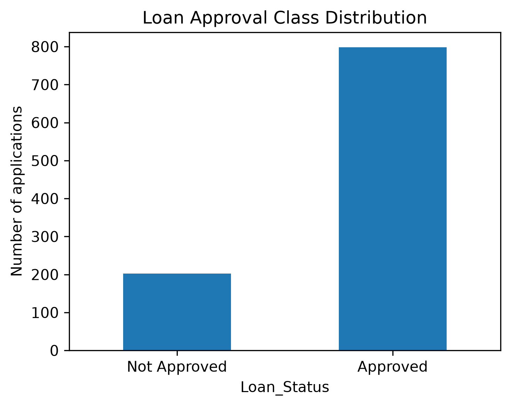
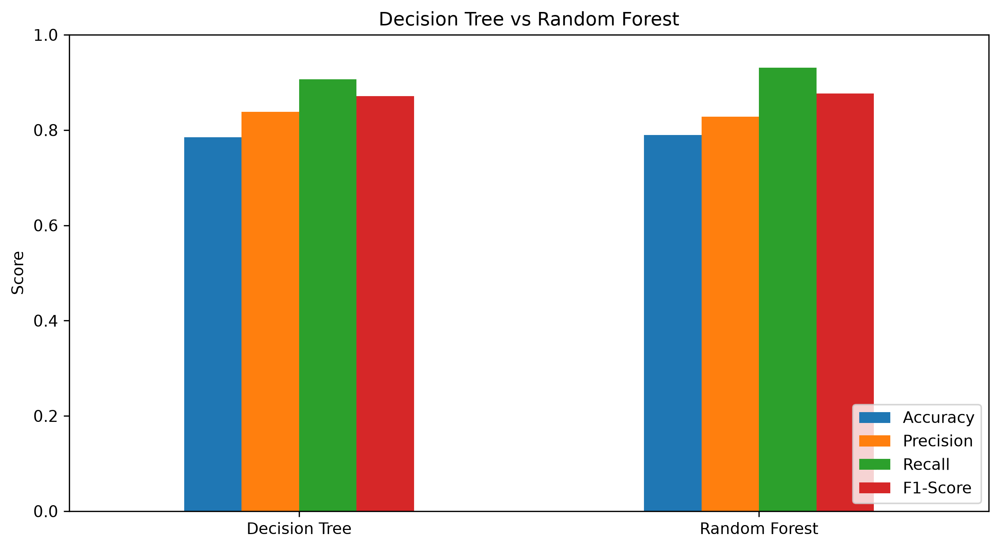
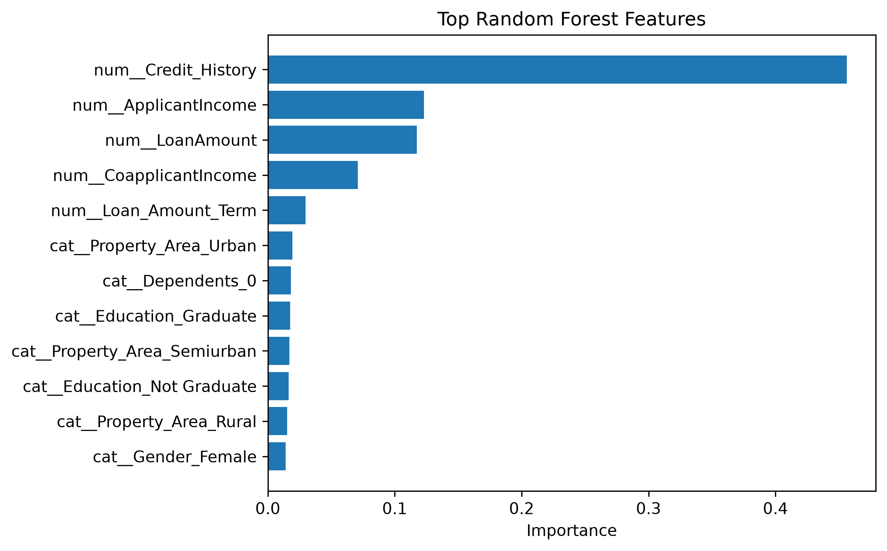

# Loan Approval Prediction

## Objective
Predict whether a loan application will be approved using **Decision Tree** and **Random Forest** classifiers.

## Dataset
The included `data/loan_approval.csv` contains 1,000 diverse loan applications following the common 13-column loan-prediction schema: applicant details, income, loan amount, credit history, property area, and loan status.

For learning purposes, the included dataset is **synthetic**, with realistic variation and intentionally introduced missing values so the preprocessing step is demonstrated clearly.

A common public loan-prediction dataset uses the same fields, including Gender, Married, Dependents, Education, Self_Employed, ApplicantIncome, CoapplicantIncome, LoanAmount, Loan_Amount_Term, Credit_History, Property_Area and Loan_Status.

## Workflow
1. Load the dataset
2. Inspect missing values
3. Fill missing numeric values using median
4. Fill missing categorical values using most frequent value
5. Encode categorical variables using One-Hot Encoding
6. Train Decision Tree
7. Train Random Forest
8. Compare classification metrics
9. Analyze Random Forest feature importance

## Project Structure

```text
loan_approval_prediction_task5/
├── loan_approval_prediction.ipynb
├── README.md
├── requirements.txt
├── data/
│   └── loan_approval.csv
└── outputs/
    ├── class_distribution.png
    ├── missing_values.png
    ├── model_comparison.png
    ├── random_forest_confusion_matrix.png
    └── random_forest_feature_importance.png
```

## Results

| Model | Accuracy | Precision | Recall | F1-Score |
|---|---:|---:|---:|---:|
| Decision Tree | 0.785 | 0.838 | 0.906 | 0.871 |
| Random Forest | 0.790 | 0.828 | 0.931 | 0.876 |

## Visuals

### Class Distribution



### Model Comparison



### Random Forest Feature Importance



Other generated graphs are available in the `outputs/` folder:
- `outputs/missing_values.png`
- `outputs/random_forest_confusion_matrix.png`

The notebook itself contains the `plt.savefig(...)` lines used to generate these figures.

## Run

```bash
pip install -r requirements.txt
jupyter notebook loan_approval_prediction.ipynb
```

## Note
This is an educational ML project. Loan approval models should not be used as real lending decisions without appropriate validation, fairness checks, governance and domain review.
