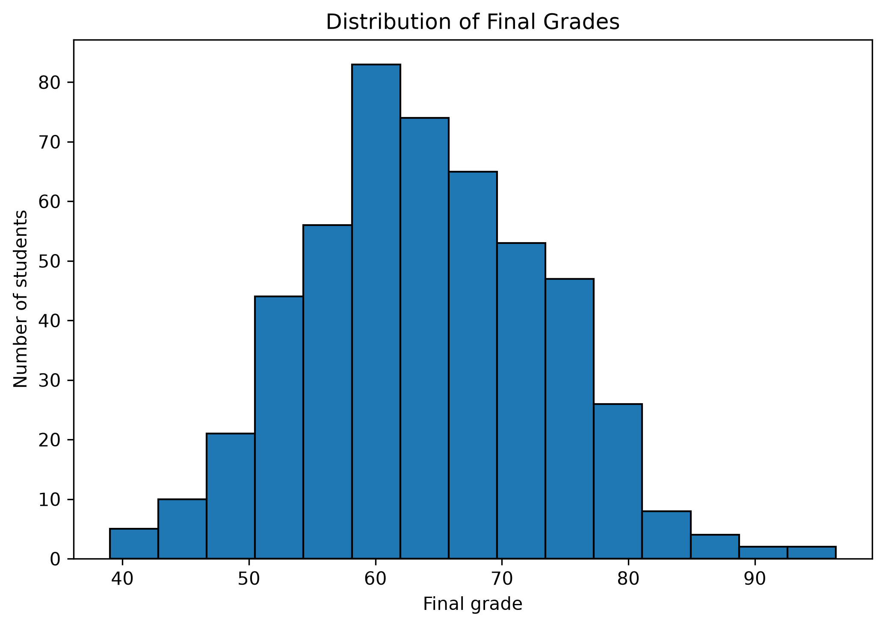
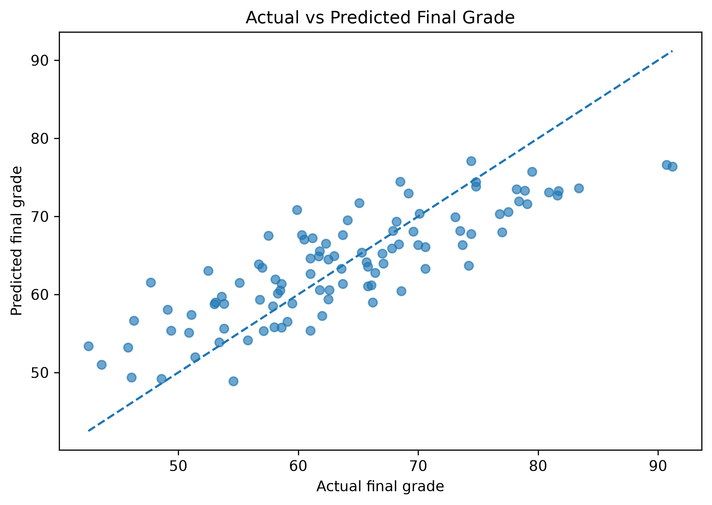
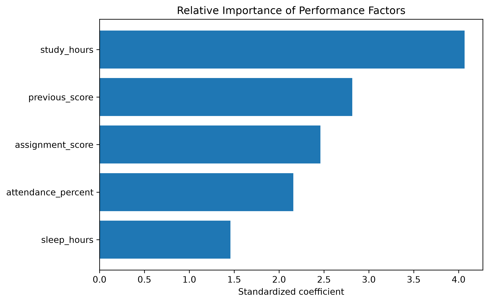

# Task 3: Predict Student Performance

A clean machine-learning project using **multiple linear regression** to predict student final grades and identify the factors most strongly associated with performance.

## Dataset

The included CSV contains **500 diverse student records**.

| Feature | Description |
|---|---|
| `study_hours` | Average study hours |
| `attendance_percent` | Attendance percentage |
| `previous_score` | Previous academic score |
| `assignment_score` | Assignment score |
| `sleep_hours` | Average sleep hours |
| `final_grade` | Final grade / target |

The final grades vary substantially across students rather than being repeated or concentrated at one value.

## Workflow

```text
Dataset
  ↓
Exploration
  ↓
Train/Test Split
  ↓
Multiple Linear Regression
  ↓
MAE / RMSE / R²
  ↓
Coefficient Analysis
  ↓
Standardized Feature Importance
```

## Results

With the included data and an 80/20 split:

- **MAE:** 4.84
- **RMSE:** 5.86
- **R²:** 0.672

## Visualizations

### Final Grade Distribution



### Actual vs Predicted



### Relative Importance



Other generated graphs are available in `outputs/` but are intentionally not all embedded here.

## Project Structure

```text
student_performance_regression/
├── student_performance_regression.ipynb
├── README.md
├── requirements.txt
├── data/
│   └── student_performance.csv
└── outputs/
    ├── actual_vs_predicted.png
    ├── correlation_matrix.png
    ├── final_grade_distribution.png
    ├── regression_coefficients.png
    └── standardized_importance.png
```

## How to Run

```bash
pip install -r requirements.txt
jupyter notebook
```

Open `student_performance_regression.ipynb` and run all cells from top to bottom.

## Scope

The project intentionally stays simple: **EDA → multiple regression → evaluation → factor analysis**. No unnecessary advanced models are included.
